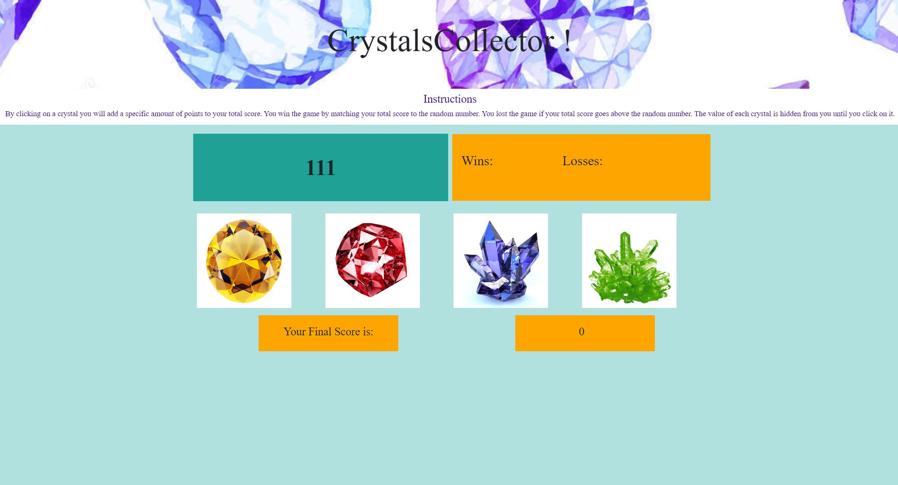

# Crystal Collector
Background - The Crystal Collector Game tests the player's memory and mathematical skills. Utilizing JavaScript random number generators, each crystal is given a value. Players do not know this value - but each time they click the crystal their score is increased by the value of the crystal. The goal is for the Player to exactly hit a randomly selected target value using a combination of the crystals. This algorithm is developed with HTML, CSS, JavaScript and jQuery.

### Instructions
You will be given a random number at the start of the game. There are four crystals on the page. By clicking on a crystal you will add a specific amount of points to your total score. You win the game by matching your total score to the random number. You lose the game if your total score goes above the random number. The value of each crystal is hidden from you until you click on it.

### Technologies Used
Built With HTML5, CSS3, Bootstrap, JavaScript, jQuery 

